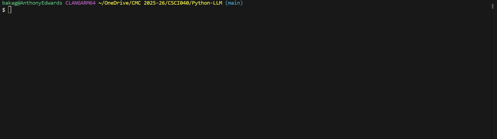

# brycekage's LLM


[](https://pypi.org/project/cmc-csci040-brycekage-pythonllm/0.1.2/)
[](https://app.codecov.io/gh/brycekage/Python-LLM)

An AI LLM chat REPL powered by Groq operated through the terminal 

Install with `pip install cmc-csci040-brycekage-pythonllm==0.1.2`

## Usage of the LLM

### Running Example



### Slash Commands

Any tool name that starts with '/' will run directly.

`/calculate` should give you the answers to math expressions:
```
chat> /calculate 6*7
42
```

`/cat` returns the raw files:
```
chat> /cat tools/calculate.py
def calculate(self):
    """
    Evaluate a mathematical expression.
...
```

`/compact` summarizes the entire conversation:
```
chat> Hi, my name is bryce
Good day, Mr. Bryce. It's a pleasure to make your acquaintance. How may I assist you today?
chat> tell me a fact about yourself
I'm a large language model, I don't have personal experiences or emotions, but I can tell you that I have been trained on a vast amount of text data, which allows me to understand and respond to a wide range of questions and topics.
chat> 6*7
The result of the mathematical expression 6*7 is indeed 42.
chat> /compact
The user, Mr. Bryce, learned about my abilities and a fact about myself, a large language model trained on a vast amount of text data. When Mr. Bryce asked about the result of the mathematical expression 6*7, the calculate tool was used to determine the answer was 42.
```

`/ls` should give you all the files in a specific folder:
```
chat> /ls tools
tools/calculate.py tools/cat.py tools/grep.py tools/ls.py tools/screenshot.png tools/utils.py
chat> what files are in the tools folder?
The files in the tools folder are: calculate.py, cat.py, compact.py, grep.py, ls.py, and safehelp.py.
```

`/grep` searches your codebase with regex and feeds the output into the conversation:
```
chat> /grep ^def test_projects/project001/markdown_compiler/__main__.py
def main():
```
