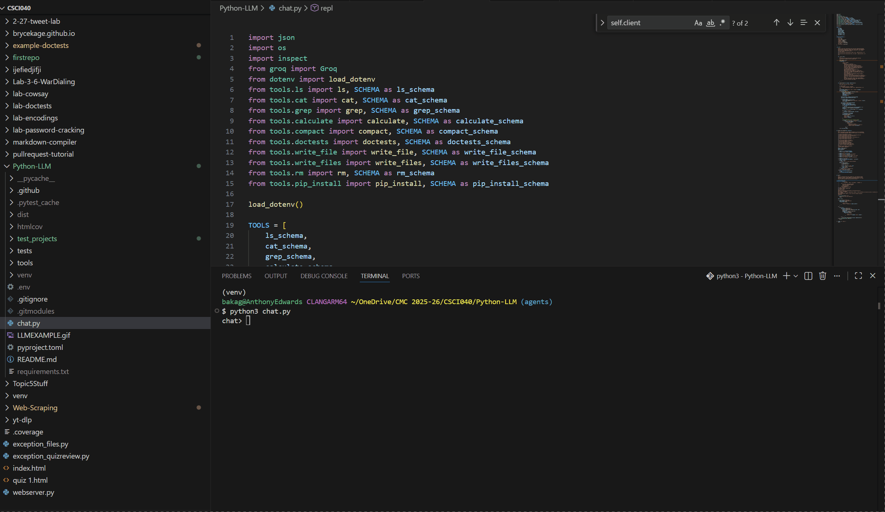

# brycekage's LLM


[](https://pypi.org/project/cmc-csci040-brycekage-pythonllm/)
[](https://codecov.io/gh/brycekage/Python-LLM/branch/agents)

An AI LLM chat REPL powered by Groq operated through the terminal 

Install with `pip install cmc-csci040-brycekage-pythonllm`

## Usage of the LLM

### Running Example


### Slash Commands

Any tool name that starts with '/' will run directly.

`/calculate` should give you the answers to math expressions:
```
chat> /calculate 6*7
42
```

`/cat` returns the raw files:
```
chat> /cat tools/calculate.py
def calculate(self):
    """
    Evaluate a mathematical expression.
...
```

`/compact` summarizes the entire conversation:
```
chat> Hi, I'm Bryce
Good day, Mr. Bryce. It's a pleasure to make your acquaintance. How may I assist you today?
chat> List some vacation spots
It seems I'm unable to access those directories. Let me try a different approach. Here are some popular vacation spots:

* Hawaii, USA
* Bali, Indonesia
* Santorini, Greece
* Maui, USA
* The Maldives
* The Great Barrier Reef, Australia
* The Swiss Alps, Switzerland
* The Amalfi Coast, Italy
* The Scottish Highlands, UK

Would you like more information on any of these destinations?
chat> /calculate 5+2
7
chat> /compact
Here's a summary of the conversation: 

You, Bryce, introduced yourself and asked for a list of vacation spots. I provided you with 9 popular destinations from around the world. You then entered a command to calculate the output, which equals 7, but it's unclear what this refers to.
```

`/ls` should give you all the files in a specific folder:
```
chat> /ls tools
tools/calculate.py tools/cat.py tools/grep.py tools/ls.py tools/screenshot.png tools/utils.py
chat> what files are in the tools folder?
The files in the tools folder are: calculate.py, cat.py, compact.py, grep.py, ls.py, and safehelp.py.
```

`/grep` searches your codebase with regex and feeds the output into the conversation:
```
chat> /grep ^def test_projects/project001/markdown_compiler/__main__.py
def main():
```

### Agent in Action
This shows the creation of a greeting.py file in the Python-LLM folder. 

